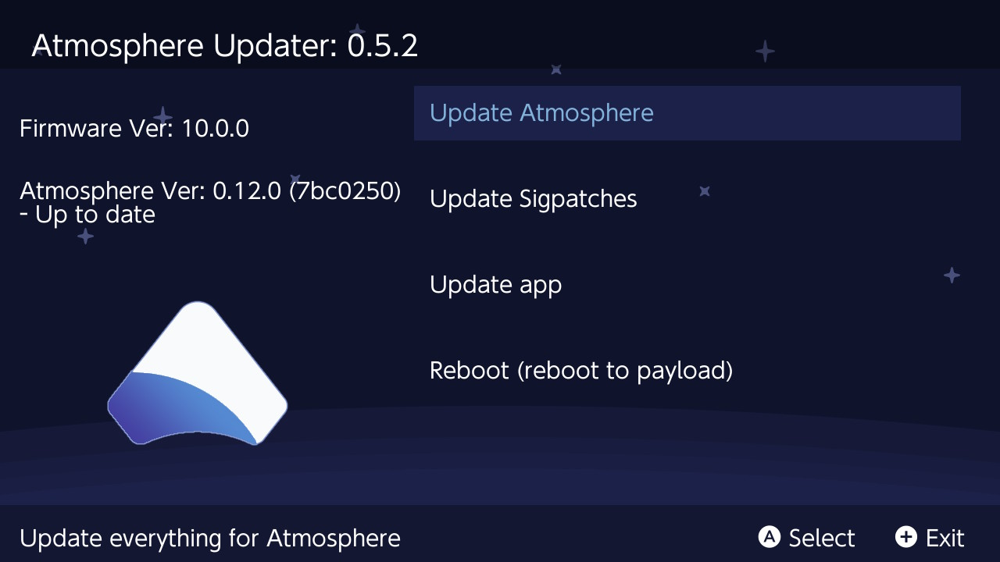

# Atmosphere-Updater

Update Atmosphere CFW and sigpatches from within your switch!

----

## Install

Download the the latest release from [here](https://github.com/eXhumer/atmosphere-updater/releases).

Move the downloaded .nro onto you Nintendo Switch SD Card inside the folder **/switch/atmosphere-updater/**.

That's it!

----

## Usage

__**The app currently has 4 main options.**__

**Update Atmosphere:**

* Downloads the latest Atmosphere release and installs everything from that release. If `/config/BCT.ini` exists in Atmosphere release, it will prompt user asking if they want to overwrite said file.
* Will also prompt user asking if they want to update sigpatches as well after downloading Atmosphere.

**Update Sigpatches:**

* Downloads the latest sigpatches from [here](https://github.com/eXhumer/patches/releases/latest).

**Update App:**

* Downloads the latest version of this app straight from GitHub!
* Deletes the previous old version.

**Reboot (reboot to payload):**

* Reboots the switch, loading the payload from **/atmosphere/reboot_payload.bin**.
* This is recommended after install Atmosphere.
* Updating Atmosphere automatically includes the needed **reboot_payload.bin**.

----

## Build

Install the devkitpro tool chain from [here](https://devkitpro.org/wiki/Getting_Started).

 Using pacman (installed with devkitpro) install the following libraries:
* switch-curl
* switch-freetype
* switch-sdl2
* switch-sdl2_gfx
* switch-sdl2_image
* switch-sdl2_ttf
* switch-zlib

If you have any problems building, feel free to open an issue including any build errors.
 
----

## Special Thanks!

[iTotalJustice](ITotalJustice) for originally developing the app.

[toph](https://github.com/sudot0ph) for the design of the app icon, as well as the most icons used within the app!

[Black Rabbit](https://github.com/BlackRabbit22) for the design of the plus and error icon (and the idea for this app)!

[bandithedoge](https://github.com/bandithedoge) for the background!

[KrankRival](https://github.com/KranKRival) for the initial sys / ams version pr (and for motivating me to work on touch controls)!
